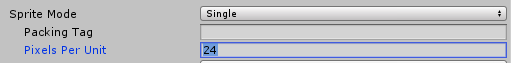
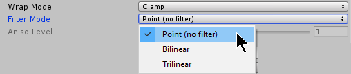
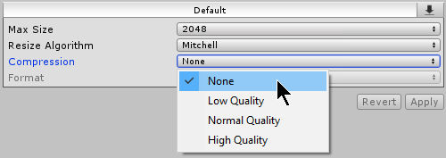
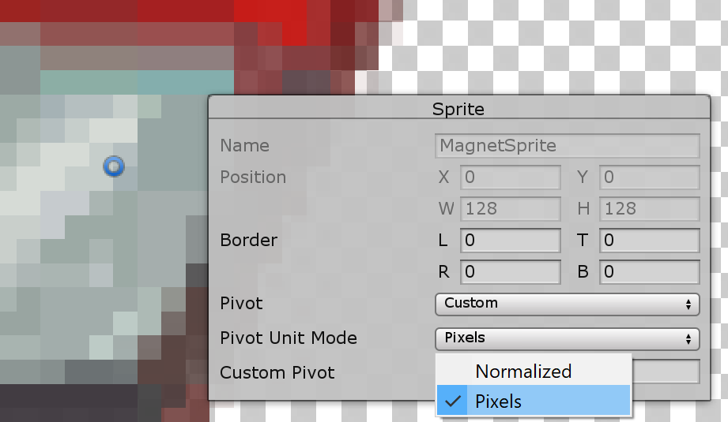
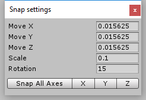
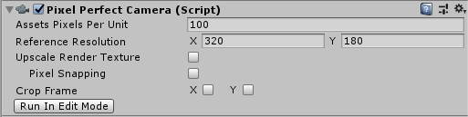
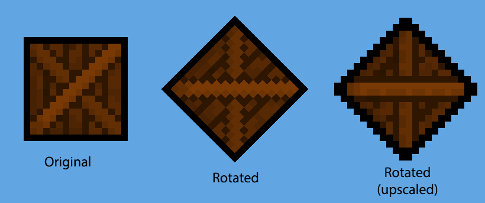
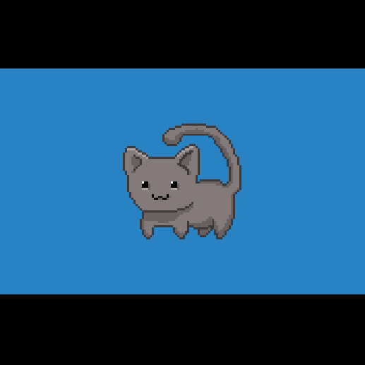

# 2D Pixel Perfect

The **2D Pixel Perfect** package contains the **Pixel Perfect Camera** component, which ensures your pixel art remains crisp and clear at different resolutions, and stable in motion. The component calculates what Unity needs to scale the viewport with resolution changes to maintain the pixel perfect visual style, so that you don’t need to calculate manually. You can use the component settings to adjust the definition of the rendered pixel art within the camera viewport, and preview any changes made in the Game view.

To begin using the component, attach the **Pixel Perfect Camera** component to the main Camera GameObject in the scene. The component is represented by two green bounding boxes centered on the **Camera** Gizmo in the Scene view. The solid green bounding box shows the visible area in Game view, while the dotted bounding box shows the [Reference Resolution](#reference-resolution).

**Important:** This standalone **2D Pixel Perfect** package is not compatible with Unity's [Scriptable Render Pipeline](xref:ScriptableRenderPipeline). This component is integrated with Unity's [Universal Render Pipeline](https://docs.unity3d.com/Packages/com.unity.render-pipelines.universal@latest) (URP), please refer to the [2D Pixel Perfect URP](https://docs.unity3d.com/Packages/com.unity.render-pipelines.universal@latest?subfolder=/manual/2d-pixelperfect.html) documentation for more information.

## How to prepare your sprites

Before using the component, follow the steps below to prepare your sprites for compatibility with the Pixel Perfect Camera component:

1. After importing your asset into the project as sprites, set all sprites to the same **Pixels Per Unit** value.

    

2. In the sprites' Inspector window, open the **Filter Mode** dropdown and select **Point**.

    

3. Open the **Compression** dropdown and select **None**.

    

Follow the steps below to set the pivot for a sprite:

1. Open the **Sprite Editor** window for the selected sprite.

2. If the sprite's **Sprite Mode** is set to **Multiple** and there are multiple individual sprite elements in the imported texture, then you need to set a pivot point for each individual sprite element.

3. In the Sprite panel at the lower left of the **Sprite Editor** window, open the **Pivot** dropdown and select **Custom**. Then open the **Pivot Unit Mode** and select **Pixels**. This allows you to set the pivot point's coordinates in pixels, or drag the pivot point around in the **Sprite Editor** and have it automatically snap to pixel corners.
    

4. Repeat step 3 for each sprite element as necessary.

## Set up snap settings

Follow the steps below to set the snap settings for your project to ensure that the movement of pixelated sprites are consistent with each other:

1. To open the __Snap settings__, go to __Edit__ > __Snap Settings.__
    

2. Set the __Move X/Y/Z__ properties to 1 divided by the Pixel Perfect Camera’s __Asset Pixels Per Unit (PPU)__ value. For example, if the Asset __PPU__ is 100, you should set the __Move X/Y/Z__ properties to 0.01 (1 / 100 = 0.01).

3. Unity does not apply Snap settings retroactively. If there are any pre-existing GameObjects in the Scene, select each of them and select __Snap All Axes__ to apply the Snap settings.

## Properties

The component's Inspector window

|__Property__|__Function__|
| --- | --- |
|__Asset Pixels Per Unit__|This is the amount of pixels that make up one unit of the Scene. Match this value to the __Pixels Per Unit__ values of all Sprites in the Scene.|
|__Reference Resolution__|This is the original resolution your Assets are designed for.|
|__Upscale Render Texture__|Enable this property to create a temporary rendered texture of the Scene close-to or at the Reference Resolution, which is then upscaled.|
|__Pixel Snapping (only available when ‘Upscale Render Texture’ is disabled)__|Enable this feature to snap __Sprite Renderers__ to a grid in world space at render-time. The grid size is based on the Assets’ __Pixels Per Unit__ value.|
|__Crop Frame__|Crops the viewport with black bars to match the Reference Resolution along the checked axis. Check X to add horizontal black bars, and Y to add vertical black bars. For more information and a visual example, refer to the Property Details below.|
|__Stretch Fill (available when both X and Y are checked)__|Enable to expand the viewport to fit the screen resolution while maintaining the viewport's aspect ratio.|
|__Run In Edit Mode__| Enable this checkbox to preview Camera setting changes in Edit Mode. This causes constant changes to the Scene while active. |
|__Current Pixel Ratio (available when ‘Run In Edit Mode’ is enabled)__|Shows the size ratio of the rendered Sprites compared to their original size.|

## Additional Property Details

### Reference Resolution

This is the original resolution your Assets are designed for. Scaling up Scenes and Assets from this resolution preserves your pixel art cleanly at higher resolutions.

### Upscale Render Texture

By default, the Scene is rendered at the pixel perfect resolution closest to the full screen resolution.

Enable this option to have the Scene rendered to a temporary texture set as close as possible to the __Reference Resolution__, while maintaining the full screen aspect ratio. This temporary texture is then upscaled to fit the entire screen.

The result is unaliased and unrotated pixels, which may be a desirable visual style for certain game projects.

### Pixel Snapping

Enable this feature to snap Sprite Renderers to a grid in world space at render-time. The grid size is based on the __Assets Pixels Per Unit__ value.

__Pixel Snapping__ prevents subpixel movement and make Sprites appear to move in pixel-by-pixel increments. This does not affect any GameObjects' Transform positions.

### Crop Frame

Crops the viewport along the checked axis with black bars to match the __Reference Resolution__. Black bars are added to make the Game view fit the full screen resolution.

|  |  |
| :-----------------------------------------: | :---------------------------------------: |
|                  Uncropped                  |                  Cropped                  |

## Cinemachine Extension

As both the __Pixel Perfect Camera__ and [Cinemachine](https://docs.unity3d.com/Packages/com.unity.cinemachine@latest) modify a Camera’s orthographic size, using these two systems together in a single Scene would cause them to fight for control over the Camera and likely produce unwanted results. To solve this incompatibility, add the [Cinemachine Pixel Perfect](https://docs.unity3d.com/Packages/com.unity.cinemachine@2.4/manual/CinemachinePixelPerfect.html) extension to your [virtual cameras](https://docs.unity3d.com/Packages/com.unity.cinemachine@2.4/manual/CinemachineSetUpVCam.html). You can find more information about the extension’s features in the [Cinemachine documentation](https://docs.unity3d.com/Packages/com.unity.cinemachine@2.4/manual/CinemachinePixelPerfect.html).